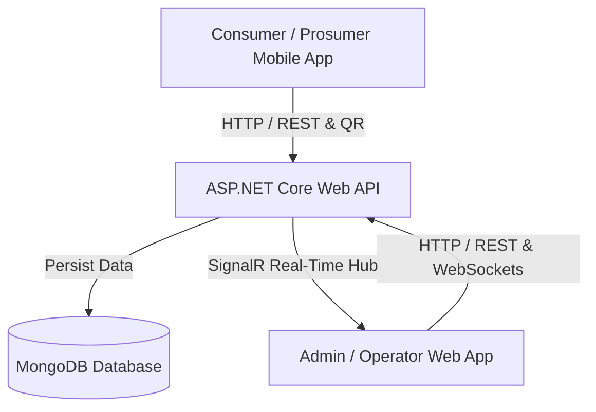

# ☀️ Smart Solar Microgrid Trading & Charging System

[](https://dotnet.microsoft.com/)
[](https://react.dev/)
[](https://developer.android.com/)
[](https://www.mongodb.com/)
[](https://tailwindcss.com/)
[](https://www.usebruno.com/)

A modern, full-stack Enterprise Application for decentralized **Smart Solar Microgrid Energy Trading**, **EV Charging Slot Reservations**, **Station Operator Verification**, and **Real-time Microgrid Analytics**.

Developed as an **Enterprise Application Development (EAD)** project at **SLIIT**.

---

## 📑 Table of Contents

- [Overview](#-overview)
- [Key Features](#-key-features)
- [System Architecture](#-system-architecture)
- [Tech Stack](#-tech-stack)
- [Repository Structure](#-repository-structure)
- [Getting Started](#-getting-started)
  - [Prerequisites](#prerequisites)
  - [1. Backend API Setup](#1-backend-api-setup)
  - [2. Web Application Setup](#2-web-application-setup)
  - [3. Android Mobile Setup](#3-android-mobile-setup)
  - [4. Bruno API Testing](#4-bruno-api-testing)
- [Environment Configuration](#-environment-configuration)
- [API Documentation](#-api-documentation)
- [License & Credits](#-license--credits)

---

## 🌟 Overview

The **Smart Solar Microgrid Trading & Charging System** connects solar prosumers (energy producers), EV owners, microgrid station operators, and backoffice administrators into a unified energy trading ecosystem. 

It empowers solar energy owners to monetize excess clean energy while providing EV drivers with seamless station discovery, slot reservation, real-time status tracking, and instant QR-code-based verification at charging stations.



---

## 🔥 Key Features

### 🚗 Prosumer & EV Consumer (Mobile App & Web)
* **Interactive Map Search**: Discover nearby microgrid charging stations using Google Maps (Android) and Leaflet (Web).
* **Energy Slot Booking**: Reserve time slots for EV charging or green energy transfer.
* **Dynamic QR Code Generation**: Instant QR code generation for smooth on-site verification.
* **Real-time Availability**: View live slot updates driven by SignalR WebSockets.

### 🏭 Station Operators
* **QR Verification Engine**: Scan customer QR codes on-site using the built-in Android camera scanner (ZXing) or web portal to validate reservations.
* **Slot Management**: Create, update, and toggle solar energy charging slot availability.
* **Operator Dashboard**: View daily transaction volume, total kWh delivered, and station performance analytics.

### 🛡️ Backoffice Administrators
* **User Management**: Oversee Prosumers, Consumers, Station Operators, and Admin profiles with RBAC security.
* **Microgrid Node Monitoring**: Register and manage microgrid solar generation nodes.
* **Transaction & Audit Logs**: Inspect system-wide trading logs, reservations, and financial settlements.

---

## 🏗️ System Architecture

The project follows a **Clean Architecture / Modular Monolith** approach separated into 3 main application tiers:

```
                  +-----------------------------------+
                  |      React 19 + Vite Web App      |
                  |   (Admin & Operator Dashboard)    |
                  +-----------------+-----------------+
                                    |
+-----------------------------------+-----------------------------------+
|               Native Android Kotlin Mobile Application                |
|                    (EV Drivers & Solar Prosumers)                     |
+-----------------------------------+-----------------------------------+
                                    |
                                    v
                  +-----------------------------------+
                  |  ASP.NET Core Web API (.NET 10)   |
                  |  - SignalR Real-Time Station Hub  |
                  |  - JWT Bearer Authentication      |
                  |  - Modular Monolith Controllers  |
                  +-----------------+-----------------+
                                    |
                                    v
                  +-----------------------------------+
                  |          MongoDB Database         |
                  |   (Users, Stations, Reservations) |
                  +-----------------------------------+
```

---

## 🛠️ Tech Stack

### Backend API (`/api`)
- **Framework**: .NET 10.0 (ASP.NET Core Web API)
- **Database**: MongoDB (MongoDB.Driver 2.28)
- **Security**: JWT Bearer Tokens, BCrypt password hashing, OAuth (Google, Facebook, Apple)
- **Real-Time Engine**: ASP.NET Core SignalR Core (`/hubs/stations`)
- **API Documentation**: OpenAPI / Swashbuckle Swagger UI (`/swagger`)

### Web Frontend (`/web`)
- **Core**: React 19, Vite, JavaScript (ES Next)
- **Styling**: Tailwind CSS v4, Lucide React Icons
- **State & Router**: React Router v7, Redux with Redux Thunk
- **Maps & Charts**: Leaflet.js, Recharts analytics library
- **WebSockets**: `@microsoft/signalr` client

### Mobile Application (`/mobile`)
- **Language**: Kotlin (Android SDK 35, Java 21)
- **UI & Architecture**: Android Material Design 3, ViewBinding, ViewModel, Lifecycle Scope
- **Maps & Location**: Google Maps SDK (`play-services-maps`), Location Services (`play-services-location`)
- **QR Code Scanning**: ZXing Android Embedded library (`zxing-android-embedded`)
- **Concurrency**: Kotlin Coroutines (`kotlinx-coroutines-android`)

### API Collection (`/bruno`)
- Automated endpoint collection using **Bruno API Client** for API testing and manual debugging.

---

## 📁 Repository Structure

```
Smart-Solar-Microgrid-Trading-System/
├── api/                             # .NET 10 Web API Backend
│   └── SmartSolarMicrogrid.API/
│       ├── Data/                    # MongoDB Context & Database Seeders
│       ├── Helpers/                 # Password Hashing, JWT Helpers
│       ├── Modules/                 # Feature Modules
│       │   ├── Authentication/      # Auth & Login Endpoints
│       │   ├── Dashboard/           # Operator Dashboard Analytics
│       │   ├── EnergySlots/         # Slot Scheduling & Pricing
│       │   ├── Microgrid/           # Microgrid Node Management
│       │   ├── Reservations/        # Energy Slot Booking System
│       │   ├── StationsMap/         # Station Geo-Locations & SignalR Hub
│       │   ├── Transactions/        # QR Code Verification & Operator Services
│       │   └── Users/               # User Profiles & Backoffice Management
│       └── Program.cs               # Application Startup & DI Configuration
├── web/                             # React 19 Web Portal (Admin & Operator)
│   ├── src/                         # React Components, Pages & Redux Store
│   ├── index.html
│   ├── package.json
│   └── vite.config.js
├── mobile/                          # Native Android Mobile App (Kotlin)
│   ├── app/                         # Android App Source (Activities, Layouts)
│   ├── build.gradle.kts
│   └── settings.gradle.kts
└── bruno/                           # Bruno API Request Collection
```

---

## 🚀 Getting Started

### Prerequisites

Ensure you have the following installed on your developer machine:
- **[.NET 10 SDK](https://dotnet.microsoft.com/download)** (or .NET 8+)
- **[Node.js](https://nodejs.org/)** (v18.x or higher) & `npm`
- **[Android Studio](https://developer.android.com/studio)** (Ladybug or newer) with JDK 21
- **[MongoDB](https://www.mongodb.com/try/download/community)** (Local instance or MongoDB Atlas cluster connection string)

---

### 1. Backend API Setup

1. Navigate to the API project directory:
   ```bash
   cd api/SmartSolarMicrogrid.API
   ```

2. Configure your MongoDB connection string in `appsettings.json`:
   ```json
   {
     "MongoDbSettings": {
       "ConnectionString": "mongodb://localhost:27017",
       "DatabaseName": "SmartSolarMicrogridDb"
     },
     "Jwt": {
       "Key": "YOUR_SUPER_SECRET_JWT_KEY_MIN_32_CHARS_LONG",
       "Issuer": "SmartSolarAPI",
       "Audience": "SmartSolarClients"
     }
   }
   ```

3. Restore dependencies and run the API:
   ```bash
   dotnet restore
   dotnet run
   ```

4. Open your browser and navigate to `https://localhost:7198/swagger` (or port indicated in console) to explore the Swagger UI documentation.

---

### 2. Web Application Setup

1. Navigate to the web application directory:
   ```bash
   cd web
   ```

2. Install dependencies:
   ```bash
   npm install
   ```

3. Create or check `.env` file for backend API URL:
   ```env
   VITE_API_BASE_URL=https://localhost:7198/api
   VITE_SIGNALR_HUB_URL=https://localhost:7198/hubs/stations
   ```

4. Launch the Vite development server:
   ```bash
   npm run dev
   ```

5. Access the web app in your browser at `http://localhost:5173`.

---

### 3. Android Mobile Setup

1. Open **Android Studio**.
2. Select **Open an existing project** and choose the `mobile/` directory.
3. Allow Gradle to sync dependencies automatically.
4. Ensure your `local.properties` contains your Android SDK location and optionally a Google Maps API Key:
   ```properties
   sdk.dir=C\:\\Users\\YourUser\\AppData\\Local\\Android\\Sdk
   MAPS_API_KEY=YOUR_GOOGLE_MAPS_API_KEY
   ```
5. Run the application on an Android Emulator or physical device (Min SDK 24 / Target SDK 35).

---

### 4. Bruno API Testing

1. Download and install [Bruno API Client](https://www.usebruno.com/).
2. Open Bruno and click **Open Collection**.
3. Select the `bruno/` folder located at the root of this repository.
4. Execute endpoint tests (Authentication, Station queries, Slot Reservations, Operator Approval).

---

## 🔐 Environment Configuration

| Service | File Path | Key Variables | Description |
| :--- | :--- | :--- | :--- |
| **Backend API** | `api/SmartSolarMicrogrid.API/appsettings.json` | `MongoDbSettings:ConnectionString`, `Jwt:Key` | MongoDB connection string & JWT secret key |
| **Web Portal** | `web/.env` | `VITE_API_BASE_URL` | Base URL for REST API backend |
| **Android App** | `mobile/local.properties` | `MAPS_API_KEY` | Google Maps API key for Android map rendering |

---

## 📡 API Endpoints Summary

| Module | Endpoint | Method | Description |
| :--- | :--- | :--- | :--- |
| **Auth** | `/api/auth/login` | `POST` | Authenticate user & receive JWT token |
| **Auth** | `/api/auth/register` | `POST` | Register a new Consumer or Prosumer |
| **Stations** | `/api/stations` | `GET` | Get list of microgrid solar stations |
| **Slots** | `/api/slots/available` | `GET` | Query available energy charging slots |
| **Reservations** | `/api/reservations` | `POST` | Create a new energy slot reservation |
| **Operator** | `/api/operator/verify-qr` | `POST` | Verify customer reservation QR code |
| **Dashboard** | `/api/operator/dashboard` | `GET` | Fetch real-time operator station metrics |
| **Users** | `/api/users` | `GET` | Admin endpoint to manage registered users |

---

## 🎓 Academic Context

This project was created for the **Enterprise Application Development (EAD)** module at **Sri Lanka Institute of Information Technology (SLIIT)**.

Developed with ❤️ by the **Smart Solar Microgrid Team**.
